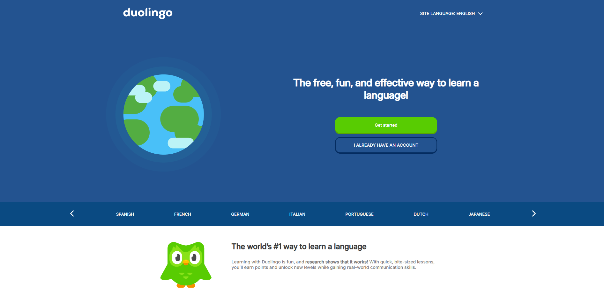

# Duolingo Clone - Projeto de Estágio

Este projeto é um clone da versão web (sem responsividade) do Duolingo, desenvolvido como parte do programa de estágio da **Premiersoft Academy**. O objetivo principal foi recriar a interface do site utilizando apenas HTML e CSS, simulando a experiência de aprendizado de idiomas oferecida pela plataforma Duolingo.

## Tecnologias Utilizadas

- **HTML5**
- **CSS3** 

## Objetivos do Projeto

- Recriar a interface web (sem responsividade) do Duolingo de maneira visualmente fiel.
- Desenvolver habilidades de estilização com CSS puro.
- Compreender a organização e estruturação de projetos web simples.

## Como Rodar o Projeto

Este projeto pode ser facilmente executado em qualquer navegador moderno. Para visualizar o clone do Duolingo, basta seguir os seguintes passos:

1. Baixe ou clone este repositório para sua máquina local.
2. Abra o arquivo `index.html` no seu navegador de preferência.
3. Você verá a versão do site Duolingo construída com HTML e CSS.

## Pré-requisitos

- Um navegador web moderno (Chrome, Firefox, Edge, Safari, etc.).
- Editor de texto (caso queira editar o código).

## Licença

Este projeto é de código aberto e pode ser utilizado livremente. No entanto, respeite as diretrizes de uso de marcas e identidades visuais do Duolingo.

---

**Premiersoft Academy - Estágio 2024**
